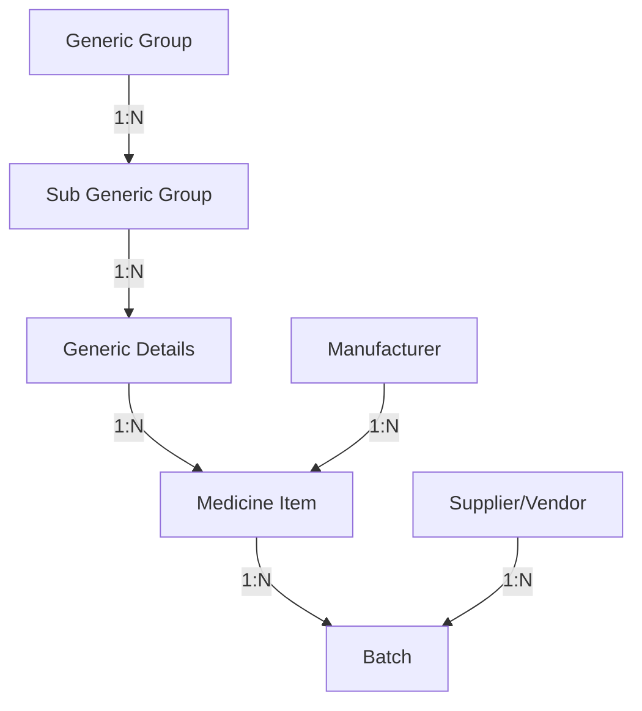

# Medicine Master Data Structure - Implementation Guide

## 📋 Overview

This document describes the hierarchical master data structure for the HIMS Medical Store module, following pharmaceutical industry best practices and regulatory compliance requirements.

## 🏗 Master Data Hierarchy

```
1. Generic Group (Therapeutic Category)
   └─→ 2. Sub Generic Group (Therapeutic Sub-Category)
       └─→ 3. Generic Details (Active Ingredient)
           └─→ 4. Medicine Item (Brand + Formulation)
                + Manufacturer
```

## 📦 Master Files Created

All master pages are located in: `src/central-stores/pages/medical-store/masters/`

### 1. **Generic Group Master** (`GenericGroupMaster.tsx`)
**Purpose:** Define high-level therapeutic categories

**Route:** `/hims/central-stores/medical-store/activities/generic-group-master`

**Menu Path:** Activities → Medicine Masters → Generic Group Master

**Data Structure:**
```typescript
interface GenericGroup {
  id: number;
  groupName: string;      // e.g., "Analgesics", "Antibiotics"
  groupCode: string;      // e.g., "ANA", "ANT"
  description: string;
  isActive: boolean;
  createdDate: string;
  createdBy: string;
}
```

**Features:**
- ✅ Add/Edit/Block operations
- ✅ Search by name or code
- ✅ Unblock functionality
- ✅ Status management (Active/Blocked)

**Examples:**
- Analgesics (ANA)
- Antibiotics (ANT)
- Antidiabetics (AND)
- Cardiovascular (CAR)
- Respiratory (RES)

---

### 2. **Sub Generic Group Master** (`SubGenericGroupMaster.tsx`)
**Purpose:** Define specific drug classes within therapeutic categories

**Route:** `/hims/central-stores/medical-store/activities/sub-generic-group-master`

**Menu Path:** Activities → Medicine Masters → Sub Generic Group Master

**Data Structure:**
```typescript
interface SubGenericGroup {
  id: number;
  subGroupName: string;        // e.g., "NSAIDs", "Penicillins"
  subGroupCode: string;        // e.g., "NSAID", "PEN"
  genericGroupId: number;      // Parent Generic Group
  genericGroupName: string;    // Display parent name
  description: string;
  isActive: boolean;
  createdDate: string;
}
```

**Features:**
- ✅ Linked to Generic Group (parent-child relationship)
- ✅ Cascading dropdowns
- ✅ Mapping with Generic Group
- ✅ Add/Edit/Block operations

**Examples:**
```
Analgesics →
  - NSAIDs (NSAID)
  - Opioids (OPI)
  - Antipyretics (ANP)

Antibiotics →
  - Penicillins (PEN)
  - Cephalosporins (CEP)
  - Macrolides (MAC)
```

---

### 3. **Generic Details Master** (`GenericDetailsMaster.tsx`)
**Purpose:** Define active pharmaceutical ingredients with detailed properties

**Route:** `/hims/central-stores/medical-store/activities/generic-details-master`

**Menu Path:** Activities → Medicine Masters → Generic Details Master

**Data Structure:**
```typescript
interface GenericDetails {
  id: number;
  genericName: string;          // e.g., "Paracetamol"
  scientificName: string;       // Chemical name
  genericGroupId: number;
  genericGroupName: string;
  subGenericGroupId: number;
  subGenericGroupName: string;
  routeOfAdmin: string[];       // ["Oral", "IV", "IM"]
  dosageForm: string[];         // ["Tablet", "Syrup", "Injection"]
  schedule: string;             // "H", "H1", "X", "G"
  isNarcotic: boolean;
  isControlled: boolean;
  description: string;
  isActive: boolean;
  createdDate: string;
}
```

**Features:**
- ✅ Cascading Generic Group → Sub Generic Group selection
- ✅ Multiple route of administration support
- ✅ Multiple dosage form support
- ✅ Drug schedule classification
- ✅ Narcotic/Controlled substance flags
- ✅ Scientific nomenclature

**Available Options:**
```typescript
Routes: ["Oral", "IV", "IM", "SC", "Topical", "Inhalation", "Rectal", "Ophthalmic"]
Forms: ["Tablet", "Capsule", "Syrup", "Injection", "Cream", "Ointment", "Drops", "Spray"]
Schedules: ["H", "H1", "X", "G", "None"]
```

**Examples:**
- Paracetamol → Analgesics → NSAIDs → Routes: [Oral, IV] → Forms: [Tablet, Syrup, Injection]
- Morphine → Analgesics → Opioids → Schedule: H1 → Narcotic: Yes
- Amoxicillin → Antibiotics → Penicillins → Routes: [Oral, IM] → Forms: [Capsule, Syrup]

---

### 4. **Medicine Item Master** (`MedicineItemMaster.tsx`)
**Purpose:** Define final sellable products (Brand + Strength + Formulation)

**Route:** `/hims/central-stores/medical-store/activities/medicine-item-master`

**Menu Path:** Activities → Medicine Masters → Medicine Item Master

**Data Structure:**
```typescript
interface MedicineItem {
  id: number;
  itemCode: string;              // "MED001" (Auto/Manual)
  itemName: string;              // Auto-generated from Generic + Strength + Form
  genericId: number;
  genericName: string;
  manufacturerId: number;
  manufacturerName: string;
  strength: string;              // "500mg"
  dosageForm: string;            // "Tablet"
  packSize: number;              // 10
  unitType: string;              // "Tablet", "ml", "mg"
  schedule: string;              // Inherited from Generic
  hsnCode: string;               // For GST
  reorderLevel: number;          // Min stock threshold
  maxLevel: number;              // Max stock threshold
  rackLocation: string;          // Storage location
  mrp: number;                   // Maximum Retail Price
  isActive: boolean;
  createdDate: string;
}
```

**Features:**
- ✅ Auto-generates item name: `{Generic} {Strength} {DosageForm}`
  - Example: "Paracetamol 500mg Tablet"
- ✅ Links to Generic Details (inherits schedule, routes, forms)
- ✅ Links to Manufacturer
- ✅ Inventory management (reorder levels, max levels)
- ✅ Stock location tracking
- ✅ HSN code for GST compliance
- ✅ Multiple unit types support

**Auto-fill Logic:**
When Generic + Manufacturer + Strength + Dosage Form are selected:
```
Item Name = "{Generic Name} {Strength} {Dosage Form}"
Example: Generic="Paracetamol" + Strength="500mg" + Form="Tablet"
Result: "Paracetamol 500mg Tablet"
```

**Examples:**
- MED001: Paracetamol 500mg Tablet | Cipla | Pack: 10 | Rack: A-12
- MED002: Amoxicillin 250mg Capsule | Sun Pharma | Pack: 10 | Rack: B-05
- MED003: Metformin 500mg Tablet | Dr. Reddy's | Pack: 15 | Rack: C-18

---

### 5. **Manufacturer Master** (`ManufacturerMaster.tsx`)
**Purpose:** Manage pharmaceutical manufacturing companies

**Route:** `/hims/central-stores/medical-store/activities/manufacturer-master`

**Menu Path:** Activities → Medicine Masters → Manufacturer Master

**Data Structure:**
```typescript
interface Manufacturer {
  id: number;
  name: string;              // "Cipla Ltd"
  code: string;              // "CIP"
  gstNumber: string;         // 15-digit GST
  address: string;
  city: string;
  state: string;
  pincode: string;
  contactPerson: string;
  phone: string;
  email: string;
  isActive: boolean;
  createdDate: string;
}
```

**Features:**
- ✅ Company details management
- ✅ GST number validation
- ✅ Complete address information
- ✅ Contact details
- ✅ Block/Unblock functionality

**Examples:**
- Cipla Ltd (CIP) - Mumbai, Maharashtra
- Sun Pharmaceutical Industries Ltd (SUN) - Mumbai, Maharashtra
- Dr. Reddy's Laboratories Ltd (DRL) - Hyderabad, Telangana

---

## 🔗 Relationships



---

## 📝 Data Entry Workflow

### Step-by-Step Process:

#### 1️⃣ **Create Generic Group**
```
Activities → Medicine Masters → Generic Group Master
Add: Name="Analgesics", Code="ANA", Description="Pain relievers"
```

#### 2️⃣ **Create Sub Generic Group**
```
Activities → Medicine Masters → Sub Generic Group Master
Select Generic Group: "Analgesics"
Add: Name="NSAIDs", Code="NSAID", Description="Non-Steroidal Anti-Inflammatory Drugs"
```

#### 3️⃣ **Create Generic Details**
```
Activities → Medicine Masters → Generic Details Master
Select Generic Group: "Analgesics"
Select Sub Generic Group: "NSAIDs"
Add:
  - Generic Name: "Paracetamol"
  - Scientific Name: "N-(4-hydroxyphenyl)acetamide"
  - Routes: ☑ Oral, ☑ IV
  - Forms: ☑ Tablet, ☑ Syrup, ☑ Injection
  - Schedule: "H"
  - Description: "Pain reliever and fever reducer"
```

#### 4️⃣ **Create Manufacturer**
```
Activities → Medicine Masters → Manufacturer Master
Add:
  - Name: "Cipla Ltd"
  - Code: "CIP"
  - GST: "27AAACG7979B1Z2"
  - Address, City, State, Contact details
```

#### 5️⃣ **Create Medicine Item**
```
Activities → Medicine Masters → Medicine Item Master
Select:
  - Generic: "Paracetamol"
  - Manufacturer: "Cipla Ltd"
  - Strength: "500mg"
  - Dosage Form: "Tablet"
Auto-fills: Item Name = "Paracetamol 500mg Tablet"
Add:
  - Pack Size: 10
  - Unit Type: "Tablet"
  - HSN Code: "30049099"
  - Reorder Level: 500
  - Max Level: 5000
  - Rack Location: "A-12"
  - MRP: ₹50.00
```

---

## 🎨 UI Features (Common Across All Masters)

### Theme Integration:
- Uses universal CSS variables from `theme.css`
- Neutral gray color scheme (#d6d6d6 sidebar, #e9ecef headers)
- Consistent table headers (#6c757d)

### Standard Components:
- ✅ **Page Header**: Back button + Title + Search box + Add button
- ✅ **Data Table**: Sortable, searchable, with action buttons
- ✅ **Modal Forms**: For Add/Edit operations
- ✅ **Status Badges**: Active (green) / Blocked (red)
- ✅ **Action Buttons**: Edit, View, Block/Unblock

### Search Functionality:
All masters support real-time search across multiple fields:
- Generic Group: Name, Code
- Sub Generic Group: Name, Code, Parent Group
- Generic Details: Generic Name, Scientific Name, Group
- Medicine Item: Item Name, Code, Generic, Manufacturer
- Manufacturer: Name, Code, GST, City

---

## 🔐 Access Control

All master pages are protected by:
- Authentication guard (requires login)
- Access codes (501-505) for permission-based access
- Redux state management for user authorization

Access Codes:
```typescript
501: Generic Group Master
502: Sub Generic Group Master
503: Generic Details Master
504: Medicine Item Master
505: Manufacturer Master
```

---

## 🚀 Navigation

### Menu Location:
```
Central Stores → Medical Store → Activities → Medicine Masters
```

### Submenu Items:
1. Generic Group Master
2. Sub Generic Group Master
3. Generic Details Master
4. Medicine Item Master
5. Manufacturer Master

### Breadcrumb Navigation:
```
HIMS → Central Stores → Medical Store → Activities → [Master Name]
```

---

## 💾 API Integration

### Expected API Endpoints:
```typescript
// Generic Groups
GET    /api/medical-store/generic-groups
POST   /api/medical-store/generic-groups
PUT    /api/medical-store/generic-groups/:id
DELETE /api/medical-store/generic-groups/:id

// Sub Generic Groups
GET    /api/medical-store/sub-generic-groups
POST   /api/medical-store/sub-generic-groups
GET    /api/medical-store/sub-generic-groups/by-group/:groupId

// Generic Details
GET    /api/medical-store/generic-details
POST   /api/medical-store/generic-details
GET    /api/medical-store/generic-details/by-sub-group/:subGroupId

// Medicine Items
GET    /api/medical-store/medicine-items
POST   /api/medical-store/medicine-items
GET    /api/medical-store/medicine-items/by-generic/:genericId

// Manufacturers
GET    /api/medical-store/manufacturers
POST   /api/medical-store/manufacturers
```

### Service Implementation Pattern:
```typescript
// Create service in: src/api/medical-store/medicine-master-service.ts
import { HttpClientWrapper } from '../http-client-wrapper';

export class MedicineMasterService {
  private httpClient: HttpClientWrapper;

  constructor() {
    this.httpClient = new HttpClientWrapper();
  }

  async fetchGenericGroups() {
    return this.httpClient.get('/api/medical-store/generic-groups');
  }

  async saveGenericGroup(data: any) {
    return this.httpClient.post('/api/medical-store/generic-groups', data);
  }
  
  // ... more methods
}
```

---

## 📊 Benefits of This Structure

### 1. **Regulatory Compliance**
- ✅ Drug schedule tracking (H, H1, X, G)
- ✅ Narcotic/Controlled substance identification
- ✅ GST compliance with HSN codes

### 2. **Inventory Management**
- ✅ Reorder level alerts
- ✅ Max stock level management
- ✅ Rack location tracking
- ✅ Multiple batch support

### 3. **Reporting & Analytics**
- ✅ Reports by therapeutic category
- ✅ Generic substitution analysis
- ✅ Manufacturer-wise stock reports
- ✅ Schedule-wise medicine tracking

### 4. **Data Consistency**
- ✅ Prevents duplicate generics
- ✅ Standardized naming conventions
- ✅ Hierarchical data integrity
- ✅ Auto-generated item names

### 5. **Clinical Decision Support**
- ✅ Route of administration guidance
- ✅ Available dosage form information
- ✅ Generic-brand mapping
- ✅ Scientific name reference

---

## 🔄 Future Enhancements

### Planned Features:
1. **Batch Master Integration**: Track expiry, MRP per batch
2. **Supplier Mapping**: Link medicines to approved suppliers
3. **Rate Contract Management**: Vendor-wise pricing
4. **Drug Interaction Database**: Clinical decision support
5. **Barcode Integration**: QR code generation for items
6. **Stock Alerts**: Automated reorder notifications
7. **Expiry Tracking**: Medicine expiry alerts
8. **Generic Substitution**: Alternative brand suggestions

---

## 📞 Support

For technical assistance or feature requests:
- **Module**: Central Stores - Medical Store
- **Component**: Medicine Masters
- **Location**: `/src/central-stores/pages/medical-store/masters/`

---

## 📝 Change Log

### Version 1.0 (December 2024)
- ✅ Initial implementation of all 5 master pages
- ✅ Integration with Activities menu
- ✅ Router configuration
- ✅ Theme CSS application
- ✅ Mock data for testing

---

**Last Updated:** December 16, 2024
**Status:** ✅ Implemented and Ready for Testing
